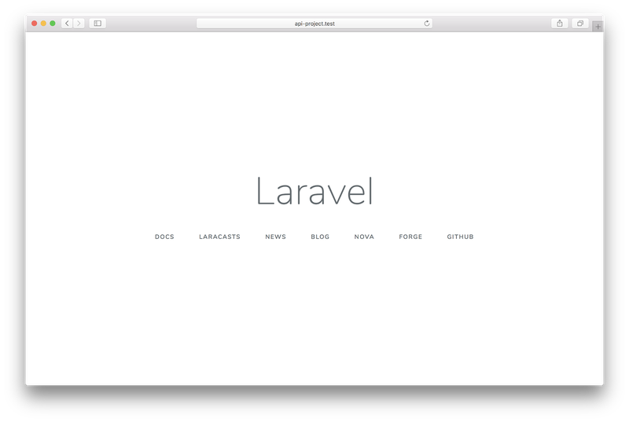
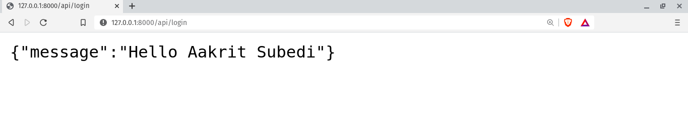
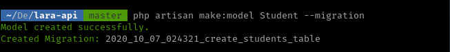
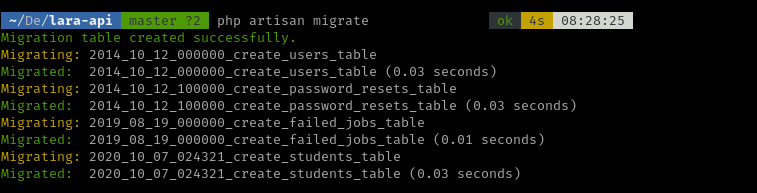
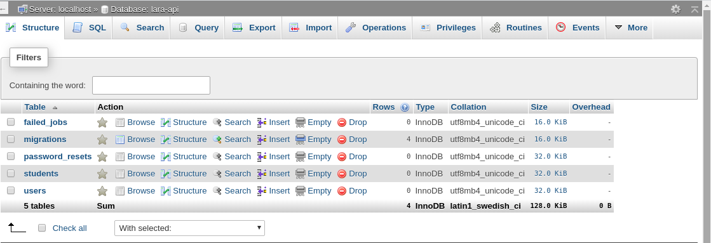
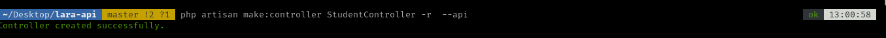
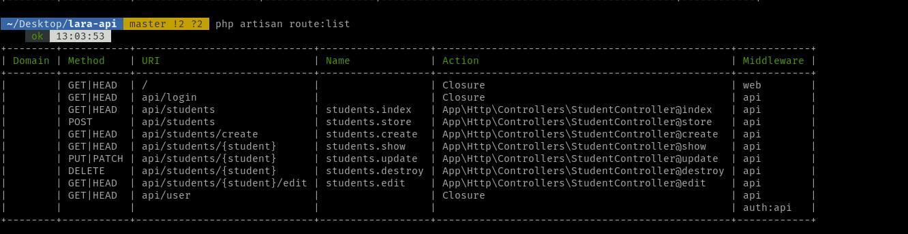
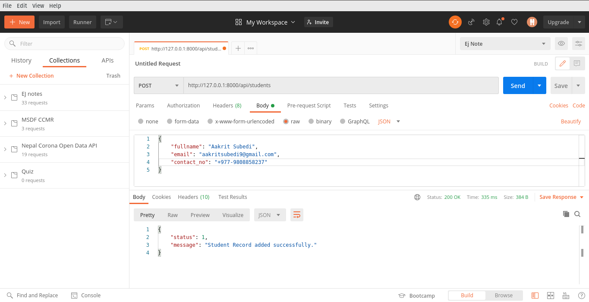

<p align="center"><a href="https://laravel.com" target="_blank"></a></p>

### About Laravel

Laravel is a web application framework with expressive, elegant syntax. We believe development must be an enjoyable and creative experience to be truly fulfilling. Laravel takes the pain out of development by easing common tasks used in many web projects, such as:

-   [Simple, fast routing engine](https://laravel.com/docs/routing).
-   [Powerful dependency injection container](https://laravel.com/docs/container).
-   Multiple back-ends for [session](https://laravel.com/docs/session) and [cache](https://laravel.com/docs/cache) storage.
-   Expressive, intuitive [database ORM](https://laravel.com/docs/eloquent).
-   Database agnostic [schema migrations](https://laravel.com/docs/migrations).
-   [Robust background job processing](https://laravel.com/docs/queues).
-   [Real-time event broadcasting](https://laravel.com/docs/broadcasting).

Laravel is accessible, powerful, and provides tools required for large, robust applications.

### Making API using laravel api

-   **Setup the Laravel Application**
    To get started, you have to create a Laravel application. To do this you have to run the following command in your terminal:

```shell
$ composer create-project --prefer-dist laravel/laravel lara-api
```

Next, change your current directory to the root folder of the project:

```shell
$ cd api-project
```

Next, start up the Laravel server if it’s not already running:

```shell
$ php artisan serve
```

You will be able to visit your application on https://localhost:8000


Next, create a new [database](https://www.mysqltutorial.org/mysql-create-database/) for your application.

### Writing your first API

Proceed to the routes directory and open the api.php file and create the endpoints that will reference the methods.

```php
Route::get('/login', function() {
    return ['message' => 'Hello Aakrit Subedi'];
});
```

**Note:** All routes in api.php are prefixed with /api by default.

Now, visit http://127.0.0.1:8000/api/login


### CRUD API for students record:

CRUD is basically

-   get all students record **[GET]**
-   Add/Create the student record **[POST]**
-   get the single student record **[GET]**
-   Update the single student record **[PUT/PATCH]**
-   Delete the student record **[DELETE]**

### Understanding our Application

We will be building a CRUD API. CRUD means Create, Read, Update, and Delete. Our API will have the following endpoints:

-   `GET /api/students` will return all students and will be accepting `GET` requests.
-   `POST /api/students` will create a new student record and will be accepting `POST` requests.
-   `GET /api/students/{id}` will return a student record by referencing its id and will be accepting `GET` requests.
-   `PUT /api/students/{id}` will update an existing student record by referencing its id and will be accepting `PUT` requests.
-   `DELETE /api/students/{id}` will delete a student record by referencing its id and will be accepting `DELETE` requests.

### Steps

to create a resources(students) in Laravel

1. Create the **database** and **migrations**

```shell
$ php artisan make:migration create_student_table --create=student
```

2. Model and Service

-   Create a **modal**

```shell
$ php artisan make:model Student
```

---

```shell
$ php artisan make:model Student --migration
```



-   Create a **service**

3. Create a **controller** to get info from db (business logic)

```shell
$ php artisan make:controller StudentController
```

4. return that info

---

### 1. Create the database and migrations

-   Create a database in the database server of the choice and add the credentials in `.env` file

```php
DB_CONNECTION=mysql
DB_HOST=127.0.0.1
DB_PORT=3306
DB_DATABASE=db_name
DB_USERNAME=username
DB_PASSWORD=*****
```

-   Update the schema of the table in `migration` file

```php
Schema::create('students', function (Blueprint $table) {
    $table->id();
    $table->string('fullname')->require();
    $table->string('email')->unique();
    $table->string('contact_no')->nullable();
    $table->tinyInteger('status')->default(1);
    $table->timestamps();
});
```

-   Migrate the table to the database

```shell
$ php artisan migrate
```

**Note:** This will migrate the students migration and other default migrations to the database.


**student table and other default table in database**


### 2. Create a Model

Model is a class that represents the logical structure and relationship of underlying data table. In Laravel, each of the database table has a corresponding “Model” that allow us to interact with that table. Models gives you the way to retrieve, insert, and update information into your data table.

A new file named Student.php will be created in the `app` directory.  
You will have to edit the file to specify the database table we will like to interact with and the fields that can be written to:

```php
<?php

namespace App;
use Illuminate\Database\Eloquent\Model;

class Student extends Model
{
    protected $table = 'students';

    protected $fillable = [
        'fullname',
        'email',
        'contact_no',
        'status'
    ];
}

?>
```

### 3. Create a controller

Instead of defining all of your request handling logic as Closures in route files, you may wish to organize this behavior using Controller classes. Controllers can group related request handling logic into a single class. Controllers are stored in the `app/Http/Controllers` directory.

Controllers are meant to group associated request handling logic within a single class.

Now that we have the basics of the application set up, we can proceed to create a controller that will contain the methods for our API by running:

```shell
$ php artisan make:controller API/StudentController --api
```



You will find a new file named StudentController.php in the app\Http\Controllers directory.
Proceed to the routes directory and open the api.php file and create the endpoints that will reference the methods created earlier in the StudentController.

```php
...
Route::get('students', 'StudentController@index');
Route::get('students/{id}', 'StudentController@show');
Route::post('students', 'StudentController@create');
Route::put('students/{id}', 'StudentController@update');
Route::delete('students/{id}','StudentController@destroy');
```

**OR**

```php
Route::resource('students', 'StudentController'); //need to use the default name
```

**Note:** All routes in api.php are prefixed with /api by default.


##### Create a Student Record

Add logic the `index` method in the StudentController

```php
    public function store(Request $request)
    {
        $student = new Student;
        $student->fullname = $request->fullname;
        $student->email = $request->email;
        $student->contact_no = $request->contact_no;
        $student->status = 1;
        $student->save();

        return response()->json([
            "status" => 1,
            "message" => "Student Record added successfully."
        ]);
    }
```
The snippet above imports the Student model which will interact with our students table in the database. In the `store` method, we instantiated a new Request object in the method parameter followed by a new Student object. Lastly, for every $student-><column-name> the equivalent request is fetched and saved.  
If the operation is successful, a JSON response will be sent back to the API user with the message student record created and with response code 201.  
This method is already tied to the api/students as we previously defined it in our routes file located at routes/api.php.  

###### Testing
To test this endpoint open Postman and make a POST request to http://localhost:8000/api/students. Select the raw(JSON) option and pass the following values as seen in the image below:


