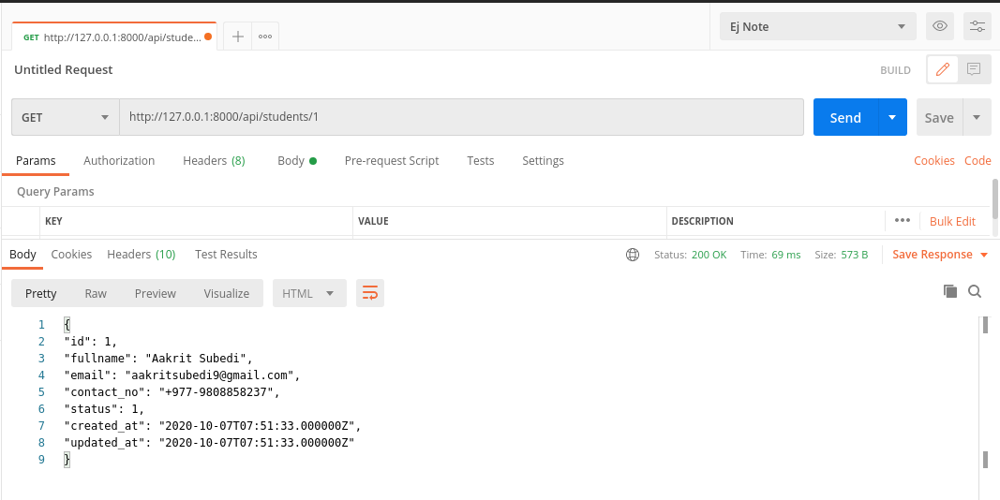

<p align="center"><a href="https://laravel.com" target="_blank"></a></p>

### About Laravel

Laravel is a web application framework with expressive, elegant syntax. We believe development must be an enjoyable and creative experience to be truly fulfilling. Laravel takes the pain out of development by easing common tasks used in many web projects, such as:

-   [Simple, fast routing engine](https://laravel.com/docs/routing).
-   [Powerful dependency injection container](https://laravel.com/docs/container).
-   Multiple back-ends for [session](https://laravel.com/docs/session) and [cache](https://laravel.com/docs/cache) storage.
-   Expressive, intuitive [database ORM](https://laravel.com/docs/eloquent).
-   Database agnostic [schema migrations](https://laravel.com/docs/migrations).
-   [Robust background job processing](https://laravel.com/docs/queues).
-   [Real-time event broadcasting](https://laravel.com/docs/broadcasting).

Laravel is accessible, powerful, and provides tools required for large, robust applications.

### Making API using laravel api

-   **Setup the Laravel Application**
    To get started, you have to create a Laravel application. To do this you have to run the following command in your terminal:

```shell
$ composer create-project --prefer-dist laravel/laravel lara-api
```

Next, change your current directory to the root folder of the project:

```shell
$ cd api-project
```

Next, start up the Laravel server if it’s not already running:

```shell
$ php artisan serve
```

You will be able to visit your application on https://localhost:8000


Next, create a new [database](https://www.mysqltutorial.org/mysql-create-database/) for your application.

### Writing your first API

Proceed to the routes directory and open the api.php file and create the endpoints that will reference the methods.

```php
Route::get('/login', function() {
    return ['message' => 'Hello Aakrit Subedi'];
});
```

**Note:** All routes in api.php are prefixed with /api by default.

Now, visit http://127.0.0.1:8000/api/login


### CRUD API for students record:

CRUD is basically

-   get all students record **[GET]**
-   Add/Create the student record **[POST]**
-   get the single student record **[GET]**
-   Update the single student record **[PUT/PATCH]**
-   Delete the student record **[DELETE]**

### Understanding our Application

We will be building a CRUD API. CRUD means Create, Read, Update, and Delete. Our API will have the following endpoints:

-   `GET /api/students` will return all students and will be accepting `GET` requests.
-   `POST /api/students` will create a new student record and will be accepting `POST` requests.
-   `GET /api/students/{id}` will return a student record by referencing its id and will be accepting `GET` requests.
-   `PUT /api/students/{id}` will update an existing student record by referencing its id and will be accepting `PUT` requests.
-   `DELETE /api/students/{id}` will delete a student record by referencing its id and will be accepting `DELETE` requests.

### Steps

to create a resources(students) in Laravel

1. Create the **database** and **migrations**

```shell
$ php artisan make:migration create_student_table --create=student
```

2. Model and Service

-   Create a **modal**

```shell
$ php artisan make:model Student
```

---

```shell
$ php artisan make:model Student --migration
```


-   Create a **service**

3. Create a **controller** to get info from db (business logic)

```shell
$ php artisan make:controller StudentController
```

4. return that info

---

### 1. Create the database and migrations

-   Create a database in the database server of the choice and add the credentials in `.env` file

```php
DB_CONNECTION=mysql
DB_HOST=127.0.0.1
DB_PORT=3306
DB_DATABASE=db_name
DB_USERNAME=username
DB_PASSWORD=*****
```

-   Update the schema of the table in `migration` file

```php
Schema::create('students', function (Blueprint $table) {
    $table->id();
    $table->string('fullname')->require();
    $table->string('email')->unique();
    $table->string('contact_no')->nullable();
    $table->tinyInteger('status')->default(1);
    $table->timestamps();
});
```

-   Migrate the table to the database

```shell
$ php artisan migrate
```

**Note:** This will migrate the students migration and other default migrations to the database.


**student table and other default table in database**


### 2. Create a Model

Model is a class that represents the logical structure and relationship of underlying data table. In Laravel, each of the database table has a corresponding “Model” that allow us to interact with that table. Models gives you the way to retrieve, insert, and update information into your data table.

A new file named Student.php will be created in the `app` directory.  
You will have to edit the file to specify the database table we will like to interact with and the fields that can be written to:

```php
<?php

namespace App;
use Illuminate\Database\Eloquent\Model;

class Student extends Model
{
    protected $table = 'students';

    protected $fillable = [
        'fullname',
        'email',
        'contact_no',
        'status'
    ];
}

?>
```

### 3. Create a controller

Instead of defining all of your request handling logic as Closures in route files, you may wish to organize this behavior using Controller classes. Controllers can group related request handling logic into a single class. Controllers are stored in the `app/Http/Controllers` directory.

Controllers are meant to group associated request handling logic within a single class.

Now that we have the basics of the application set up, we can proceed to create a controller that will contain the methods for our API by running:

```shell
$ php artisan make:controller API/StudentController --api
```


You will find a new file named StudentController.php in the app\Http\Controllers directory.
Proceed to the routes directory and open the api.php file and create the endpoints that will reference the methods created earlier in the StudentController.

```php
...
Route::get('students', 'StudentController@index');
Route::get('students/{id}', 'StudentController@show');
Route::post('students', 'StudentController@create');
Route::put('students/{id}', 'StudentController@update');
Route::delete('students/{id}','StudentController@destroy');
```

**OR**

```php
Route::resource('students', 'StudentController'); //need to use the default name
```

**Note:** All routes in api.php are prefixed with /api by default.


##### Create a Student Record

Add logic the `store` method in the StudentController

```php
    public function store(Request $request)
    {
        $student = new Student;
        $student->fullname = $request->fullname;
        $student->email = $request->email;
        $student->contact_no = $request->contact_no;
        $student->status = 1;
        $student->save();

        return response()->json([
            "status" => 1,
            "message" => "Student Record added successfully."
        ]);
    }
```

The snippet above imports the Student model which will interact with our students table in the database. In the `store` method, we instantiated a new Request object in the method parameter followed by a new Student object. Lastly, for every \$student-><column-name> the equivalent request is fetched and saved.  
If the operation is successful, a JSON response will be sent back to the API user with the message student record created and with response code 201.  
This method is already tied to the api/students as we previously defined it in our routes file located at routes/api.php.

###### Testing

To test this endpoint open Postman and make a POST request to http://localhost:8000/api/students. Select the raw(JSON) option and pass the following values as seen in the image below:


##### Return all Student Records

Now let us update the `index` method in our StudentController.  
We will use the already imported Student model to make a simple eloquent query to return all students in the database.

```php
public function index()
{
    $students = Student::get()->toJson(JSON_PRETTY_PRINT);

    return response($students, 200);
}
```

The eloquent query ends with ->toJson(JSON_PRETTY_PRINT); which will serialize the object data return by eloquent into a nicely formatted JSON. The JSON is returned with the response code 200.

###### Testing

Assuming our application is running in the background, make a GET request to the /api/students endpoint in Postman.

As seen in the image above, the endpoint returns all the student records in the database.

##### Return a student record

You will be creating an endpoint to return just a single student record. To begin you have to visit the `show` method in the StudentController.

```php
public function show($id)
{
    if (Student::where('id', $id)->exists()) {
        $student = Student::findOrFail($id)->toJson(JSON_PRETTY_PRINT);

        return response($student, 200);
    } else {
        return response()->json([
            "status" => 0,
            "message" => "Student not found"
        ], 404);
    }
}
```

The snippet above first checks if a student record with the given id exists. If it does, it queries the database using eloquent to return the record with matching id in JSON with 200 as the response code. If the id given is not found in the database it will return a student not found message with a 404 response code.

Next, let us try requesting a non-existent student record.

As seen in the image above, a request was made to the endpoint to return the details of the student record with the id of 2 which is non-existent. Our API did a good job by returning an error message along with the 404 status code.

##### Update a student record

We will now be creating an endpoint to update the details of an existing student record. To begin you have to visit the `update` method in the StudentController.

```php
    public function update(Request $request, $id){
        if (Student::where('id', $id)->exists()) {
            $student = Student::findOrFail($id)->update($request->all());

            return response([
                "success" => 1,
                "message" => "Student Record updated successfully"
            ], 200);

        } else {
            return response()->json([
                "status" => 0,
                "message" => "Student not found"
            ], 404);
        }
    }
```

###### Testing

To test this endpoint, return the details of the student record with the id of 1 by making a GET request to /api/students/1.
Next, let us change the contact_no to “+977-1-2070021” by making a PUT request to api/students/1. In order to make a PUT request, you have to pass a JSON payload.


##### Delete a Student Record

Finally, to delete a student record we will have to update the `destroy` method in our StudentController.
Using eloquent, we will check if the id of the record requested to be deleted exists. If it exists we will delete the record. If it does not exist, we will return a not found message along with the 404 status code.

```php
public function destroy($id){
    if (Student::where('id', $id)->exists()) {
        Student::destroy($id);

        return response()->json([
            "message" => "Student recorded delected."
        ], 202);
    } else {
        return response()->json([
            "status" => 0,
            "message" => "Student record not found"
        ], 404);
    }
}
```

###### Testing

Now, we will make a DELETE request to students/{id} where {id} is the id of the record we are requesting to be deleted. For the purpose of testing, I will delete the record with the id of 1.

The endpoint returned a success message along with status code 202 which means the request was accepted.  
Also, we can check by trying to request the record with the id of 2 by making a GET request to the /api/students/{id} endpoint. It should return a 404 indicating that the record could not be found.


---

###### Validation

Laravel provides several different approaches to validate your application's incoming data. By default, Laravel's base controller class uses a `ValidatesRequests` trait which provides a convenient method to validate incoming HTTP requests with a variety of powerful validation rules.  
Refer [Validation Docs](https://laravel.com/docs/8.x/validation) for more.

```php
// Validate the data
$request->validate([
    'fullname' => ['required', 'max:255'],
    'email' => ['required', 'unique:students'],
]);
```

###### Prefix API

The prefix method may be used to prefix each route in the group with a given URI. For example, you may want to prefix all route URIs within the group with v1(generally used for versioning):

```php
Route::prefix('v1')->group(function () {
    Route::apiResource('students', 'StudentController');
});
```

```shell
$ php artisan route:list
```

;

### JWT Authentication

-   Install via composer
    Run the following command to pull in the latest version:

```shell
$ composer require tymon/jwt-auth
```

-   Publish the config
    Run the following command to publish the package config file:

```shell
$ php artisan vendor:publish --provider="Tymon\JWTAuth\Providers\LaravelServiceProvider"
```

You should now have a config/jwt.php file that allows you to configure the basics of this package.

-   Generate secret key
    JWT auth package provides the php artisan command to set the secret

```shell
$ php artisan jwt:secret
```

This will update your .env file with something like JWT_SECRET=foobar  
It is the key that will be used to sign your tokens. How that happens exactly will depend on the algorithm that you choose to use.

-   Update the .env file to change the default values

##### Implementing the JWT Authentication

-   go to `config/auth.php` file and update driver in gaurds for api to 'jwt':

```php
'api' => [
    'driver' => 'jwt',
    'provider' => 'users',
    'hash' => false,
],
```

-   and also update the default driver to `api`

```php
'defaults' => [
    'guard' => 'api',
    'passwords' => 'users',
],
```

-   go to `app/User.php` and
    -   include the library `use Tymon\JWTAuth\Contracts\JWTSubject;`
    -   add a function named `getJWTIdentifier` to return the keys
    ```php
    public function getJWTIdentifier(){
      return $this->getKey();
    }
    ```
    -   aslo, add a funtion `getJWTCustomClaims` to return an empty array
    ```php
    public function getJWTCustomClaims(){
      return [];
    }
    ```
-   create a LoginController

```php
$ php artisan make:controller LoginController
```

-   add the login function that handles the login

```php
class LoginController extends Controller
{
    public function login(Request $request) {
        $credentials = $request->only(['email','password']);

        $token = auth()->attempt($credentials);

        return response()->json([
            'users' => $credentials,
            'token' => $token
        ]);
    }
}
```

The above login function returns the valid jwt token if credentials matches else return false.


#### Protecting the private routes

We need to create the middleware that verifies the token before accessing the private route. The middleware return an exception error if token is invalid allowing to proceed to the next route.

We need to create a `JwtMiddleware` which will protect our routes. Run this command via your terminal.

```shell
$ php artisan make:middleware JwtMiddleware
```

This will create a new middleware file inside our Middleware directory. This file can be located here app/Http/Middleware/JwtMiddleware. Open up the file and replace the content with the following:

```php
public function handle($request, Closure $next){
    try {
        $user = JWTAuth::parseToken()->authenticate();
    } catch (Exception $e) {
        if ($e instanceof \Tymon\JWTAuth\Exceptions\TokenInvalidException){
            return response()->json(['status' => 'Token is Invalid']);
        }else if ($e instanceof \Tymon\JWTAuth\Exceptions\TokenExpiredException){
            return response()->json(['status' => 'Token is Expired']);
        }else{
            return response()->json(['status' => 'Authorization Token not found']);
        }
        }

        return $next($request);
    }

```

This middleware extends Tymon\JWTAuth\Http\Middleware\BaseMiddleware, with this, we can catch token errors and return appropriate error codes to our users.  
Next, we need to register our middleware. Open app/http/Kernel.php and add the following:

```php
  [...]
    protected $routeMiddleware = [
        [...]
        'jwt.verify' => \App\Http\Middleware\JwtMiddleware::class,
    ];
    [...]
```
Next, Open routes/api.php and add the content with the following:
```php
Route::group(['middleware' => 'jwt.verify'], function () {
    Route::prefix('v1')->group(function () {
        Route::apiResource('students', 'StudentController');
    });
});
```


<h3 align="center">Thank You!!</h3>
